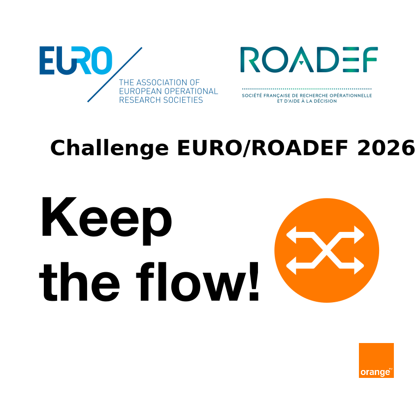

# EURO/ROADEF 2026 Challenge

## Team

- Kulczycki Robin Robin.Kulczycki@student.uliege.be
- Paulis Antoine Antoine.Paulis@student.uliege.be
- Zanella Francois

As part of the **Discrete Optimization** (MATH0462-1) course at the University of Liège, we will take part in the first part (dataset A) of the EURO/ROADEF 2026 Challenge which is explained below.

The **EURO/ROADEF 2026 Challenge** is an international optimization competition focused on solving the **T-Adaptive Segment Routing** problem that arise from the traffic engineering area.

### Documentation

- **[Problem Statement](docs/Statement.pdf)** — Statement of the course project.
- **[Problem Description](docs/Subject.pdf)** — Formal specification of the optimization problem
- **[Challenge Rules](docs/Rules.pdf)** — Official rules, submission requirements, and evaluation criteria
- **[Challenge Presentation](docs/Slides.pdf)** — Slides presented at ROADEF 2026 

## Getting Started

1. **Read the documentation**: Start with the [Problem Description](docs/Subject.pdf) and [Challenge Rules](docs/Rules.pdf)
2. **Download the datasets**: The first dataset will be released on **March 6, 2026**
4. **Develop your solution**
3. **Use the checker tool**: Validate your solutions using the provided [checker](checkers/README.md)
5. **Submit your results**: Follow the submission guidelines described in the [challenge rules](docs/Rules.pdf)

## 📦 Dataset A 
**Release Date**: March 6, 2026
**Purpose**: Initial "easy" problem instances with horizon value bounded by two

## Tools

The following tools are provided for your convenience. **There is no requirement to use them**

- **[checker](checker/README.md)** — Validates instance and solution file formats, computes objective function values, and checks solution feasibility
- **[networktools](https://gitlab.com/Orange-OpenSource/network-optimization-tools/networktools)** — C++20 network/graph optimization library

## Support

If you encounter any problems with the datasets, tools, or documentation then browse existing [issues](https://gitlab.com/Orange-OpenSource/network-optimization-tools/challenge-roadef-2026/-/issues) for answers first. Otherwise, report the issue [here](https://gitlab.com/Orange-OpenSource/network-optimization-tools/challenge-roadef-2026/-/issues/new?description_template=bug_report).
